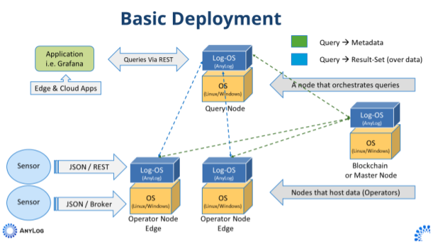

# AnyLog Service for  OpenHorizon

AnyLog is a decentralized network to manage IoT data. Nodes in the network are compute instances that execute the AnyLog 
Software. Joining a network requires the following steps:
1. Install the AnyLog Software on computer instance
2. Configure a node such that it can join an exiting network (or create a new network).

**Table of Content**:
* [Install OpenHorizon](OpenHorizon_install.md) - Steps to install OpenHorizon
* [AnyLog via EdgeService](OpenHorizon_EdgeService.md) - Steps to install AnyLog as an OpenHorizon EdgeService
* [AnyLog via Policy](OpenHorizon_policy.md) - Steps to install AnyLog via policy
* [KubeArmor](AnyLog_KubeArmor) - Accept data into AnyLog from KubeArmor via [_gRPC_](https://grpc.io/)
* [Grafana](AnyLog_Grafana.md) - Generate Grafana dashboards for AnyLog

**Other Links**
* [AnyLog Documentation](https://github.com/AnyLog-co/documentation)
* [Open Horizon Documentation](https://open-horizon.github.io/)

# General Configuration of Network

A basic network setup consists of a _master_, 2 _operator_  and _query_ node - as shown in the image below. These nodes 
can be deployed either on the same physical machine, or unique machines. Directions for [Quick Deployment](https://github.com/AnyLog-co/documentation/blob/master/deployments/Quick%20Deployment.md)
of the diagram. 

For a [3-month license key](https://anylog.co/download-anylog/) | Support: [info@anylog.co](mailto:info@anylog.co)

 